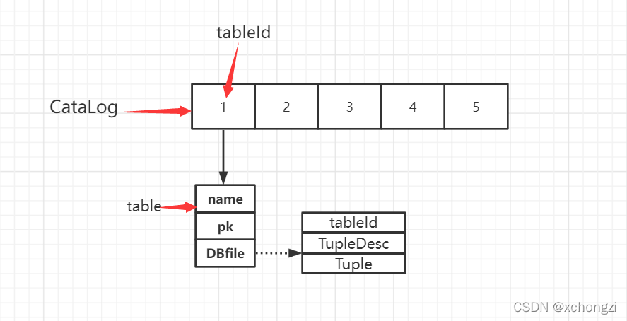

1、catalog结构

2、DBfile

附录
1、Java File类
Java文件类以抽象的方式代表文件名和目录路径名。该类主要用于文件和目录的创建、文件的查找和文件的删除等。File对象代表磁盘中实际存在的文件和目录。我们可以通过以下构造方法创建一个File对象。

public File(String pathname)
相关API：public long length()如果File表示一个具体文件，则length方法返回这个文件的字节大小；

②FileInputStream类

用于读取文件输入流。

相关API：public long skip(long number)跳过文件开头number的字节数再读取。

③RandomAccessFile类可以自由访问文件的任意位置

相关API：void seek(long pos)移动文件开头的指针到任意位置。

int read()读取一个字节的数据。